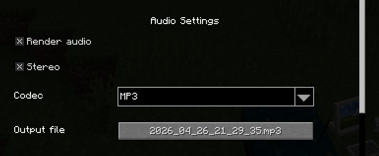

# ReplayModAudioRender

[Modrinth](https://modrinth.com/mod/replaymod-audio-render)

ReplayMod addon that captures audio while rendering a replay.

It swaps Minecraft's audio device for an [OpenAL loopback device](https://github.com/openalext/openalext/blob/master/ALC_SOFT_loopback.txt) during rendering and writes the captured audio to a file.

## Settings

**Audio Settings** section is added to the ReplayMod render menu.

